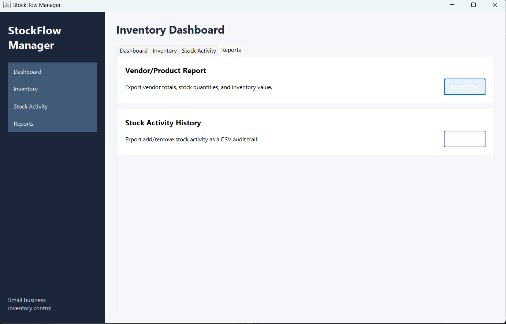
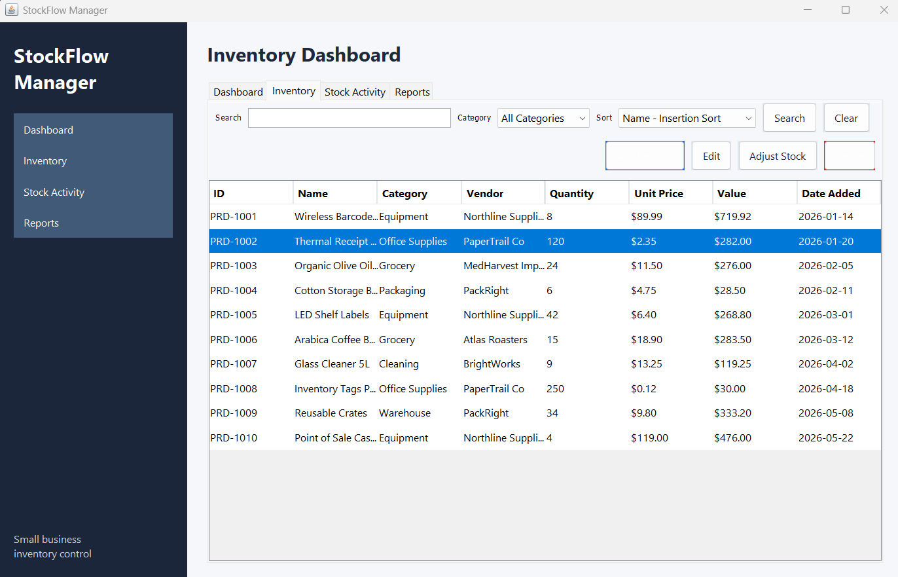
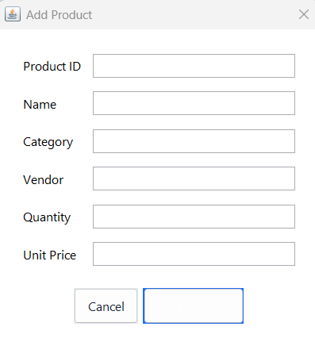
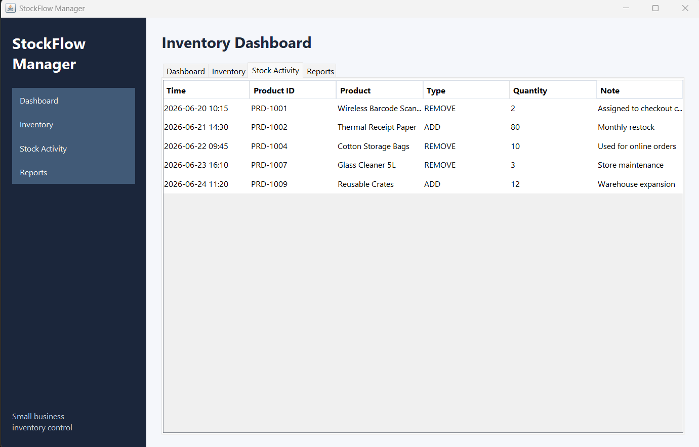
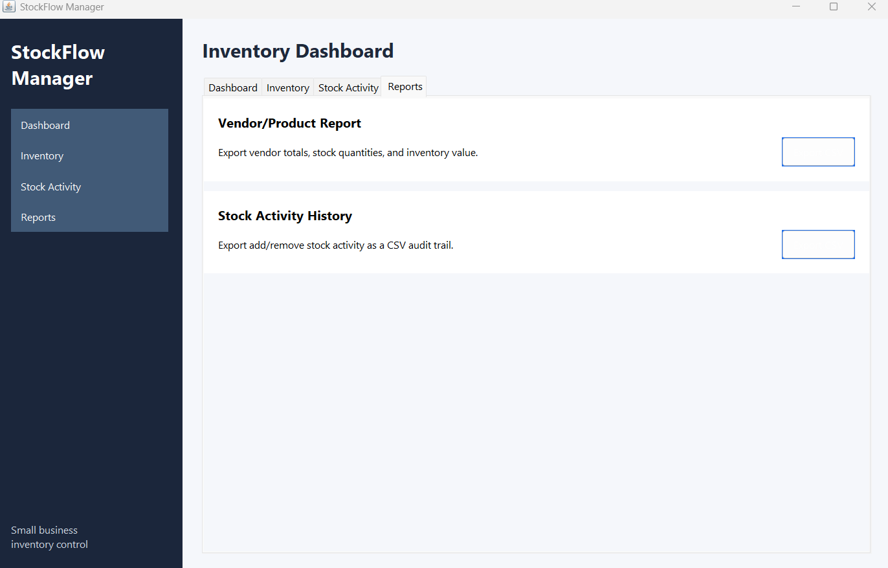

# StockFlow Manager

StockFlow Manager is a professional Java Swing desktop application for small business inventory and stock control. It is designed as a GitHub-ready portfolio project that demonstrates Java OOP, MVC architecture, data structures, algorithms, clean code, file persistence, and a polished desktop UI.

## Features

- Modern dashboard with inventory statistics cards
- JTable-based inventory table
- Add, edit, and delete products
- Search products by ID, name, or category
- Binary search by exact product ID and linear search for flexible text queries
- Category filtering
- Sorting by name, category, quantity, and date added
- Stock activity history
- Add stock and remove stock workflow
- Low stock alerts
- Vendor/product CSV reports
- Automatic CSV loading when the application starts
- Automatic save after product and stock changes
- Report export to CSV

## Architecture

The application follows MVC and separates responsibilities into clear packages:

```text
src/main/java/com/stockflow
  algorithms       Search and sorting implementations
  config           App constants and file paths
  controller       MVC controller layer
  datastructures   CustomArrayList and CustomHashMap
  model            Product, StockActivity, InventoryStats
  service          Business logic and inventory operations
  storage          CSV persistence and report export
  utils            Validation and CSV helpers
  view             Java Swing UI
```

## Algorithms

The algorithms are implemented in `algorithms/ProductSearch.java` and `algorithms/ProductSort.java` with Big O comments in the code.

| Algorithm | Big O | Used For |
| --- | --- | --- |
| Linear Search | O(n) | Flexible search by ID, name, and category |
| Binary Search | O(log n) | Exact product ID lookup after sorting by ID |
| Insertion Sort | O(n^2) | Sort by name |
| Selection Sort | O(n^2) | Sort by category |
| Merge Sort | O(n log n) | Sort by quantity and date |

## Data Structures

StockFlow Manager includes two inventory approaches:

1. **Java Collections version**
   - `InventoryService`
   - Uses `ArrayList`, `LinkedHashSet`, and standard Java collections.
   - This is the production service used by the Swing application.

2. **Custom data structures version**
   - `CustomInventoryService`
   - Uses `CustomArrayList` and `CustomHashMap`.
   - Included as a separate module to demonstrate how list growth, indexed access, hashing, chaining, and key-based lookup work internally.

## Project Data

Sample data is stored in:

```text
data/products.csv
data/stock_activity.csv
```

The app loads these files automatically on startup. When products or stock quantities change, the app saves back to the same files.

## Compile and Run

From the `StockFlow-Manager` directory:

```bash
javac -d out $(find src/main/java -name "*.java")
java -cp out com.stockflow.Main
```

On Windows PowerShell:

```powershell
javac -d out (Get-ChildItem -Recurse src/main/java/*.java).FullName
java -cp out com.stockflow.Main
```

You can also use the included scripts:

```powershell
.\scripts\build.ps1
.\scripts\run.ps1
```

## Build Runnable JAR

After compiling:

```bash
jar cfm StockFlowManager.jar manifest/MANIFEST.MF -C out .
java -jar StockFlowManager.jar
```

PowerShell helper:

```powershell
.\scripts\package.ps1
java -jar StockFlowManager.jar
```

## Screenshots

### Dashboard


### Inventory Table


### Add Product Dialog


### Stock Adjustment


### Reports


## Future Improvements

- User authentication and role-based access
- PDF report generation
- Barcode scanning support
- SQLite database storage option
- Product image attachments
- More advanced vendor analytics
- Unit tests with JUnit

## License

This project is released under the MIT License.
